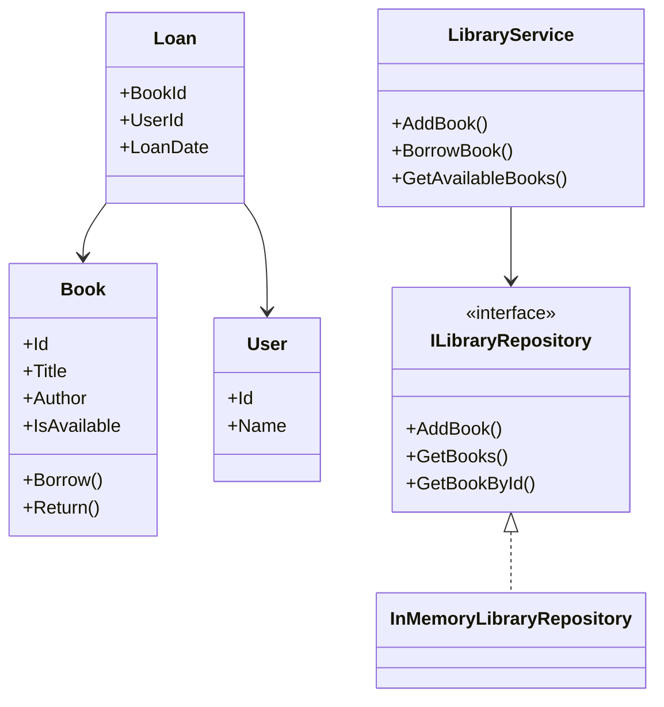

```mermaid
classDiagram

class Book {
    +Id
    +Title
    +Author
    +IsAvailable
    +Borrow()
    +Return()
}

class User {
    +Id
    +Name
}

class Loan {
    +BookId
    +UserId
    +LoanDate
}

class ILibraryRepository {
    <<interface>>
    +AddBook()
    +GetBooks()
    +GetBookById()
}

class LibraryService {
    +AddBook()
    +BorrowBook()
    +GetAvailableBooks()
}

class InMemoryLibraryRepository

ILibraryRepository <|.. InMemoryLibraryRepository
LibraryService --> ILibraryRepository
Loan --> Book
Loan --> User
```